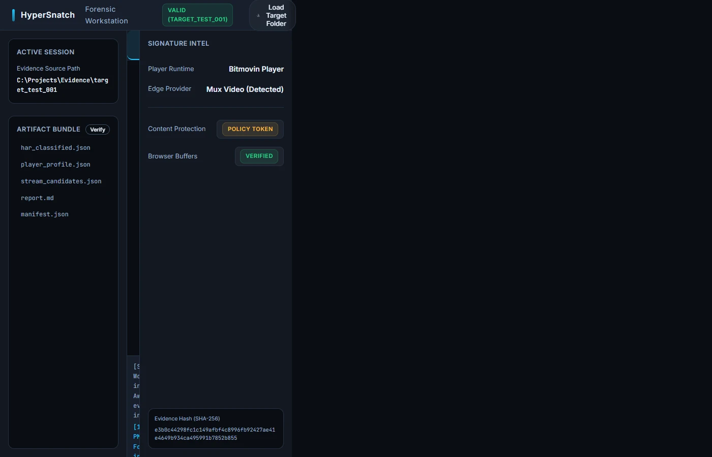

# HyperSnatch Workstation: Phase 5 Stream Forensics
## Proof of Execution & Capability Overview

### The Forensic Workstation UI

### What Can It Do?

The Phase 5 upgrade graduates HyperSnatch from a headless extraction engine into a visual, analytical **Stream Forensics Workstation**. It provides deep, deterministic intelligence on exactly how video streams are delivered, protected, and routed across the web.

#### 1. Chronological Timeline Forensics (`parseTimeline.js`)
* **What it does:** Restructures raw, asynchronous network HAR data into a linear, indexable timeline.
* **Why it matters:** Analysts can visually track the exact sequence of events—from the initial index manifest request down to the final decryption key fetch—revealing the behavioral signature and load order of the target player.

#### 2. Stream Ladder Reconstruction (`buildStreamLadder.js`)
* **What it does:** Parses complex M3U8 and DASH MPD manifest payloads to extract the adaptive bitrate tiers (e.g., 1080p @ 3Mbps, 720p @ 1.5Mbps) and codec configurations.
* **Why it matters:** Immediately identifies the maximum quality video stream available for extraction and exposes exactly how the content provider structures their delivery bandwidth.

#### 3. Waterfall Pattern Clustering (`buildWaterfall.js`)
* **What it does:** Scans hundreds of individual `.ts` or `.m4s` segment requests and groups them logically by base delivery path and tenant origin.
* **Why it matters:** Allows operators to distinguish between primary content chunks, ad-insertion segments, and secondary audio tracks, mapping the true topology of the media delivery network.

#### 4. Edge CDN Footprinting (`detectCDN.js`)
* **What it does:** Heuristically analyzes the most frequent hostnames in the request pool and fingerprints them against known Content Delivery Networks (Akamai, CloudFront, Fastly, Mux, etc.).
* **Why it matters:** Identifying the underlying delivery infrastructure is crucial for bypassing geographic blocks, understanding the provider's scaling architecture, and routing extraction traffic efficiently.

#### 5. Tokenized Pattern Detection (`detectTokenPatterns.js`)
* **What it does:** Scrapes URI query strings for structural patterns associated with DRM policies, edge authentication (e.g., Akamai `hdnts`), or bespoke signature hashing.
* **Why it matters:** Immediately alerts the analyst if the stream is protected by simple time-to-live (TTL) limits or complex cryptographic DRM, dictating the necessary bypass strategy.

### The "Why": Institutional-Grade Intelligence
By presenting these five dimensions of data in a unified dashboard, HyperSnatch reduces the time required to analyze a protected video stream from hours of manual HAR inspection down to milliseconds. It transforms raw network intercepts into actionable, structured intelligence, ensuring a **100% deterministic approach** to stream extraction and bypassing modern obfuscation tactics.
