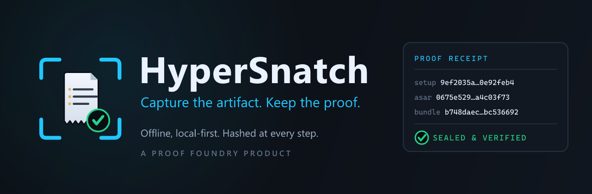

<p align="center">
  
</p>

# HyperSnatch

**Local-first Windows proof workstation.**  
Capture artifacts, export receipt-backed proof bundles, and verify them offline — no cloud dependency, cryptographic proof at every step.

A [Proof Foundry](https://github.com/Z3r0DayZion-install/hypersnatch) product.

[](https://github.com/Z3r0DayZion-install/hypersnatch/releases/tag/v1.6.18)
[](#)
[](#)

---

## Download

**[HyperSnatch-Setup-1.6.18.exe](https://github.com/Z3r0DayZion-install/hypersnatch/releases/tag/v1.6.18)** — Windows installer

SHA256 hashes in [`SHA256SUMS.txt`](https://github.com/Z3r0DayZion-install/hypersnatch/releases/download/v1.6.18/SHA256SUMS.txt) and [`docs/release/RECEIPT_v1.6.18.md`](docs/release/RECEIPT_v1.6.18.md).

---

## What it does

- **Decode & capture** — pull and store evidence bundles from streams and URLs
- **Investigate** — build cases, log findings, attach bundles, run comparisons
- **Sign & verify** — record hashes, receipts, proof bundle metadata, and verification results
- **Graph & analyze** — map infrastructure topology, find hot nodes, bridges, and cross-case correlations
- **Trust registry** — track and verify intelligence sources
- **Workspace management** — assign cases to analysts, manage teams
- **Policy engine** — enforce export/redact/seal rules at the operator level
- **Local-first** — no cloud dependency, no external calls during investigation

Everything is stored as a verifiable `.hsn` capsule. Hashes are recorded at every stage.

---

## Proof

Every release ships with a signed proof record:

- `release:gate` must pass before any tag is created
- Installer SHA256 hashes are recorded in `docs/release/RELEASE_PROOF_vX.Y.Z.md`
- 99 E2E Playwright tests cover the full operator UI surface

---

## Build from source

```powershell
npm install
npm run dist
```

Requires Node.js 18+ and Windows (Electron build target).

---

## Verify a download

```powershell
Get-FileHash .\HyperSnatch-Setup-1.6.18.exe -Algorithm SHA256
```

Compare against [`SHA256SUMS.txt`](https://github.com/Z3r0DayZion-install/hypersnatch/releases/download/v1.6.18/SHA256SUMS.txt).

---

## Release history

| Version | Notes |
|---------|-------|
| v1.6.18 | Receipt Explanation Mode: tabbed receipt viewer (Receipt Details / Explanation / Raw & Hashes), plain-English proof explanation, related proof files list, sample receipt note, honest proof language — no overclaim |
| v1.6.17 | Proof comparison + proof clarity: Proof Bundle Diff (compare two exported bundles and see same/changed/added/removed), Evidence Nutrition Label (plain-language proof-quality summary), repo hygiene cleanup (removed stale packs/scripts/assets) |
| v1.6.16 | Portable proof + tamper verification: Proof Passport for exported bundles, Prove It Again (re-verify from disk), Offline Proof Capsule verifier (`VERIFY-HYPERSNATCH.html`) bundled in exports, Tamper Trial (damages a temporary copy and proves detection), customizable Appearance/themes, improved dynamic feedback/toast/recent activity |
| v1.6.15 | First-run proof workflow: front-door workbench, window fit (1440x900), in-app sample proof workspace, receipt viewer (real SHA-256 verification), proof bundle export (clean self-verifying folder), onboarding modal, Settings trust surface |
| v1.6.14 | UI-aliveness hotfix: Settings panel (General/Evidence/Proof/Privacy & Security/Diagnostics/About), visible controls now respond with action/feedback/reason, left-rail Verify no longer silent, responsive rails, calmer idle language + packaged click audit |
| v1.6.13 | Brand/icon refresh + workbench-first IA + sample proof workspace + strict script CSP (no unsafe-inline) + packaged interaction proof |
| v1.6.12 | Critical packaged UI interaction hotfix: CSP allowed inline renderer init (script-src 'unsafe-inline'), null-guarded window/license controls, added missing SovereignAuth require |
| v1.6.11 | Public launch: asar files list fix (src/**/* — all modules now included in packaged build) — superseded |
| v1.6.10 | sandbox:false fix — superseded |
| v1.6.9 | Proof Foundry brand + consolidated window-show fixes — superseded |
| v1.6.8 | Fresh-install window-show hotfix (show:false, executeJavaScript removal, did-fail-load handler) — superseded |
| v1.6.7 | Module-load crash fixes (IntelligenceGraph require, secp256k1→prime256v1) |
| v1.6.6 | caseUpdateFinding wired, policyAudit fix, 93 E2E tests, withLoading on all async buttons |
| v1.6.5 | wsAssignCase wired, withLoading on all async buttons |
| v1.6.4 | UI polish pass, pill-btn system, input-field system |

Full changelog: [releases](https://github.com/Z3r0DayZion-install/hypersnatch/releases)
